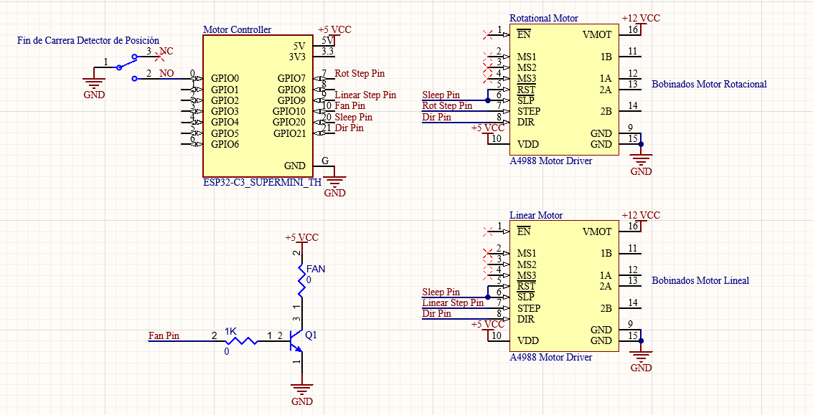

# Integrated TOMV3 + Banco de Ensayo — Web Application

A browser-based application that fuses the **TOMV3** electronic nose acquisition system with the **Banco de Ensayo** automated motorised test bench into a single coordinated workflow. The user configures everything from a web interface; the backend handles all hardware communication autonomously.

---
## Overview

The application now supports **two experiment modes**:

1. **Integrated experiment (with Banco de Ensayo motors)**
2. **Manual experiment (without Banco motors)**

### Integrated mode (with Banco)
Integrated Experiment Controller orchestrates the full measurement workflow:

1. A one-time initial desorption runs before the first measurement: fan ON, wait = configured desorption time, fan OFF.
2. For each cycle and enabled position, the arm moves in (`MOVEINHOME`), pre-conditioning runs, TOMV3 acquisition starts, the acquisition countdown runs, the arm moves out (`MOVEOUTHOME`), the desorption fan turns ON, the carousel rotates to the next position when needed, and desorption waits.
3. After desorption, the fan turns OFF and the CSV is auto-saved.
4. After all positions in a cycle, the system returns home (`ROTATIONALHOMING`).

### Manual mode (without Banco)
1. No BLE or motor commands are used.
2. TOMV3 buffers are cleared.
3. Pre-conditioning wait is applied (using the Banco pre-conditioning setting).
4. TOMV3 acquisition starts (`EXPER`).
5. Data is auto-saved to CSV using the manual sample name.

---

## Features

- **4-tab web UI**: Principal (sensor controls + manual experiment), Gráficas (live plots), Banco de Ensayo (bench settings + integrated experiment), Cámara (live USB camera stream).
- **Serial communication** with TOMV3 hardware (47-channel sensor array, 9600 baud).
- **Serial handshake on connect**: when connecting to TOMV3, the backend waits ~1 second, sends `DISPO`, and only completes the serial connection if a valid response is received.
- **Serial device status badge**: Tab 1 shows live serial status text (for example, **Connected to TOMV3D1**) similar to the ESP32 BLE status badge.
- **Bluetooth Low Energy (BLE) communication** with an ESP32 microcontroller (`ESP32_STEPPER`) controlling the stepper motor bench.
- **Integrated multi-sample, multi-cycle experiments** with Banco motors.
- **Manual no-motor experiments** with TOMV3-only phases (pre-conditioning + acquisition).
- **Real-time plots** for 6 selected sensor channels using Chart.js.
- **Auto-save to CSV** after desorption of each position — no manual export needed during integrated experiments.
- **Auto-save to CSV** after each manual experiment run (sample name from manual input).
- **Manual CSV export** also available on demand (Tab 1 → Export button).
- **Configurable save folder** — defaults to the user's Downloads folder.
- **Configurable sweep parameters**: temperature range, voltage range, steps, cycles, sweep type (TR, SQ, SWT, SN).
- **12 configurable sample positions** (up/down via `MAX_POSITIONS` in `state.py`): **Cascading position checkboxes** — enabling position N automatically enables all prior positions.
- **Configurable cycle gap time** (`cycle_gap_time`, default 0 s): adds a delay between experiment cycles after the carousel returns home, with a countdown shown in the UI.
- **Two-phase cancellation**: Cancel sends an emergency `STOP` command that immediately halts the physical motor, then the arm always moves to the safe OUT position (`MOVEOUTHOME`).
- **Persistent configuration**: ALL settings (TOMV3 params, sweep type, Banco params) are saved to `backend/session.json` and restored on next launch — no need to click "Enviar" to persist a value change.
- **Unexpected disconnect modals**: both TOMV3 serial and ESP32 BLE connections show a prominent modal alert if the connection is lost unexpectedly (user-initiated disconnects do not trigger the alert). While an integrated experiment is running, the modal is suppressed in favour of the pause banner.
- **Browser-side sound alerts (Web Audio API)**: audible notifications are generated in the browser device when the experiment-completed popup appears and on critical error popups (serial disconnect, unexpected BLE disconnect, and position-check mismatch popup).
- **Pause-on-error (integrated experiments)**: if a motor (BLE ESP32) command fails or the Bluetooth link drops during an integrated experiment, the experiment **pauses** instead of auto-cancelling. Timers freeze, the run loop blocks, and a banner appears with **Reconectar BLE** / **Continuar** / **Cancelar**:
  - **Continuar** retries the exact failed motor command; if the failure was a BLE drop, reconnect first, then click Continuar.
  - **Cancelar** performs the normal safety sequence (emergency STOP + MOVEOUTHOME + FANOFF).
  - Applies everywhere, including the initial homing and desorption phases; the countdown and progress bars resume exactly where they froze.
  - Multiple causes (BLE drop + motor failure) merge into a single banner with deduplicated reasons.
  - Plays a high-pitched warning tone when the pause banner appears.
- **Dual progress bars** during an experiment: a green per-phase bar (pre-conditioning / acquisition / desorption) and a blue global bar showing overall experiment progress and time remaining.
- **Manual experiment completion alerts**: success sound + completion popup at the end of a manual run.
- **Mutual mode lock**: manual and integrated experiments cannot run at the same time; each start button is disabled while the other mode runs.
- **Accurate position display**: the current position counter shows X/**N** where N is the number of enabled positions, not a fixed 5.
- **Mid-experiment page reload recovery**: if the browser is reloaded while an experiment is running, the current position, cycle, sample name, global progress bar (blue), and per-phase countdown bar (green) are all restored immediately upon reconnect — the experiment itself never stops.
- **Auto-send parameters on experiment start**: every time INICIAR EXPERIMENTO is pressed, the backend automatically sends the current TOMV3 sweep parameters to the device, waits 3 seconds, then sends the sweep type — ensuring the device is always configured with the latest values before the first measurement.

---

## Architecture

```
┌────────────────────────────────────┐    WebSocket    ┌──────────────────────────────┐
│  Browser  (localhost:8000)         │ ◄─────────────► │  FastAPI Backend             │
│  index.html + app.js + charts.js   │                 │  main.py                     │
│  style.css                         │                 │  experiment.py  (sequencer)  │
└────────────────────────────────────┘                 │  controller.py  (motor BLE)  │
                                                       │  serial_handler.py           │
                                                       │  state.py       (config)     │
                                                       └──────┬──────────┬────────────┘
                                                              │ BLE      │ Serial 9600
                                                     ┌────────▼──┐  ┌───▼──────────┐
                                                     │  ESP32    │  │  TOMV3  │
                                                     │ STEPPER   │  │   Device     │
                                                     │ (motors)  │  │ (47 sensors) │
                                                     └───────────┘  └──────────────┘
```

## Hardware Schematic

ESP32 + A4988 driver wiring used to control the bench motors:



| Layer | File(s) | Role |
|---|---|---|
| Frontend | `index.html`, `app.js`, `charts.js`, `style.css` | 4-tab UI, WebSocket client, Chart.js plots |
| Backend entry point | `main.py` | FastAPI app, WebSocket hub, REST endpoints, startup/shutdown |
| Experiment sequencer | `experiment.py` | Coordinates motor + serial in the correct order |
| Motor controller | `controller.py` | BLE client to ESP32 (`ESP32_STEPPER`), sends motor commands |
| Serial handler | `serial_handler.py` | Async serial I/O with TOMV3, parses 47-channel data |
| State / config | `state.py` | Dataclass + JSON persistence for all settings |
| Camera streamer | `camera.py` | MJPEG stream from USB camera via OpenCV, background thread |

---

## Project Structure

```
BancoensayoVeggie/
├── backend/
│   ├── main.py              # FastAPI application, WebSocket handler
│   ├── experiment.py        # IntegratedExperimentController — experiment loop
│   ├── controller.py        # BleController — BLE client to ESP32_STEPPER
│   ├── serial_handler.py    # SerialHandler — async serial with TOMV3
│   ├── state.py             # AppState dataclass + JSON load/save
│   ├── camera.py            # CameraStreamer — MJPEG stream via OpenCV
│   └── requirements.txt     # Python dependencies
├── frontend/
│   ├── index.html           # 4-tab Bootstrap 5 single-page application
│   ├── app.js               # WebSocket client, all UI logic
│   ├── charts.js            # Chart.js real-time plotting (6 channels)
│   └── style.css            # Merged styles
├── integratedvenv/          # Python virtual environment (not committed to git)
├── start_server.bat         # Windows startup script
├── start_server.sh          # Linux / macOS startup script
└── BancoEnsayoVeggieREADME.md
```

---

## Requirements

- **Python 3.10+**
- TOMV3 device connected via **USB serial**
- ESP32 flashed with `ble_stepper_server.cpp` and advertising as **`ESP32_STEPPER`** over BLE
- Bluetooth adapter on the server machine (built-in or USB dongle)
- **Linux extra**: the user running the server must be in the `bluetooth` group (`sudo usermod -aG bluetooth $USER`) and BlueZ must be running (`sudo systemctl status bluetooth`)

Python packages (see `backend/requirements.txt`):
```
fastapi
uvicorn[standard]
websockets
pyserial
pandas
aiofiles
opencv-python
bleak
```

---

## Setup & Installation

### 1. Clone or download the project

Place the `BancoensayoVeggie/` folder anywhere on your machine.

### 2. Create the virtual environment

Open a terminal **inside the `BancoensayoVeggie/` folder**.

**Windows (PowerShell or CMD):**
```bat
python -m venv integratedvenv
```

**Linux / macOS:**
```bash
python3 -m venv integratedvenv
```

### 3. Activate the virtual environment

**Windows:**
```bat
integratedvenv\Scripts\activate
```

**Linux / macOS:**
```bash
source integratedvenv/bin/activate
```

You should see `(integratedvenv)` at the start of your prompt.

### 4. Install dependencies

```bash
pip install -r requirements.txt
```

---
## Running the App

### Windows — double-click or run from CMD

```bash
.\start_server.bat
```

The script will:
1. Check that `integratedvenv/` exists.
2. Start the server at **http://localhost:8000**.

### Linux / macOS

```bash
chmod +x start_server.sh   # first time only
./start_server.sh
```

Same automatic steps as above.

### Manual start (any OS, with venv already activated)

```bash
cd backend
python -m uvicorn main:app --host 0.0.0.0 --port 8000 --reload
```

Then open **http://localhost:8000** in any browser.

> **Note:** Using `--host 0.0.0.0` makes the server reachable from other devices on the same network (useful for accessing from a laptop while the server runs on a lab PC). For local-only access use `--host 127.0.0.1`.

## Open to internet access using Cloudflare Quick tunnel (optional)

### Windows

Install `cloudflared` from https://developers.cloudflare.com/cloudflare-one/connections/connect-apps/install-and-setup/installation. Save the executable in `C:\cloudflared\cloudflared.exe` or update the path in the command below.

Then run this command in a separate terminal (while the server is running):

```
C:\cloudflared\cloudflared.exe tunnel --url http://localhost:8000
```


### Linux / macOS

To install `cloudflared`, run the following commands in a terminal:
```bash
cd ~
wget -O cloudflared https://github.com/cloudflare/cloudflared/releases/latest/download/cloudflared-linux-arm64
chmod +x cloudflared

sudo mv ~/cloudflared /usr/local/bin/cloudflared
```

Then run this command in a separate terminal (while the server is running):
```bash
cloudflared tunnel --url http://localhost:8000
```


---

## Usage Guide

### Tab 1 — Principal

**Serial Connection (TOMV3)**
1. Click **Refrescar** to scan for available COM ports.
2. Select the TOMV3 port from the dropdown.
3. Click **Conectar**. The backend opens the serial port, waits ~1 second, then sends `DISPO`.
4. If `DISPO` returns a device ID, the connection is accepted and the status badge shows **Connected to `<DeviceID>`** (for example, `Connected to TOMV3D1`). The button changes to **Desconectar**.
5. If `DISPO` does not return a valid response, the connection is rejected and the app remains disconnected.
   If the serial connection is lost unexpectedly while in use, a red modal alert appears automatically.

**Experiment Parameters (Parámetros TOMV3)**
| Field | Default | Description |
|---|---|---|
| TMin | 200 | Minimum temperature for sweep |
| TMax | 400 | Maximum temperature for sweep |
| VMin | 0.5 | Minimum heater voltage |
| VMax | 1.5 | Maximum heater voltage |
| Steps | 21 | Number of temperature steps per sweep |
| Cycles (VN) | 4 | Number of TOMV3 sweep repetitions |
| Sweep type | TR | TR / SQ / SWT / SN waveform |

All values are auto-saved to `session.json` as you type (500 ms debounce), so they survive a page reload without needing to click **Enviar Parámetros**. Click **Enviar Parámetros** to push the current values to the device over serial.

**Manual Experiment Control**
- The Principal tab includes **Control de Experimento Manual**.
- Enter a **sample name** and click **INICIAR EXPERIMENTO MANUAL**.
- Manual run phases:
  - Pre-conditioning (value taken from Banco tab: *Tiempo de preacondicionamiento*).
  - Acquisition (`EXPER`) with duration computed from TOMV3 sweep parameters.
- Manual mode uses **no motor/BLE commands**.
- No progress bars are shown for manual mode.
- On success, browser plays a completion tone and shows a completion popup.
- If an integrated experiment is running, manual start is disabled.

**Manual CSV Export**
- Click **Exportar datos (CSV manual)** to download a CSV of all data currently in the buffers (useful outside of an integrated experiment).

**Communication Log**
- Real-time log of all serial and motor commands, server events, and CSV save confirmations.
- Click **Limpiar** to clear it.

---

### Tab 4 — Cámara

Displays a live MJPEG stream from a USB camera connected to the server machine.

- The stream starts automatically the first time the tab is opened (`/api/video`).
- A **status badge** in the card header shows whether a camera was detected at startup and which device index is in use.
- If no camera is found, or if the camera is disconnected, a dark overlay with a descriptive message is shown over the video area.
- The **Reconectar** button (always visible in the card footer) calls `POST /api/camera/reconnect`, which attempts to reopen the camera (trying index 1 first, then 0) and restarts the stream if successful.
- The camera runs in a background thread completely isolated from the experiment, serial, and motor subsystems — no performance impact.

---

### Tab 2 — Gráficas

Six Chart.js plots update in real time as TOMV3 data arrives:

| Chart | Channel | Sensor |
|---|---|---|
| 1 | 0 | SGP40 VOC |
| 2 | 1 | SGP40 NOx |
| 3 | 2 | BME688 Resistance |
| 4 | 9 | ENS160 R2 |
| 5 | 10 | ENS160 R3 |
| 6 | 11 | ENS160 R4 |

Each plot keeps the last 100 data points.

---

### Tab 3 — Banco de Ensayo

**ESP32 BLE Connection**
1. Click **Conectar**. The backend scans for the device named `ESP32_STEPPER` (10 s timeout) and connects automatically — no address or hostname required.
2. The badge turns green on success.
   If the BLE connection is lost unexpectedly, a red modal alert appears automatically.
3. All other fields are auto-saved to `session.json` as you type (500 ms debounce).

**Posiciones de Muestras**
- Up to 12 positions are shown (see `MAX_POSITIONS` in `backend/state.py`).
- Check the boxes for the positions you want to measure.
- **Cascading logic**: enabling position N automatically enables all positions before it; disabling N disables all positions after it.
- Enter a sample name for each enabled position. The name is embedded in the CSV filename.

**Parámetros del Experimento**
| Field | Default | Description |
|---|---|---|
| Tiempo de desorción (s) | 60 | Wait time between positions for odour recovery |
| Tiempo de preacondicionamiento (s) | 300 | Stabilisation wait after MOVEDOWN, before the sweep starts |
| Ciclos | 1 | Number of full carousel repetitions |
| Tiempo entre ciclos (s) | 0 | Delay between cycles after rotational homing (countdown shown in UI) |
| Carpeta de destino | Descargas del navegador | Click **Seleccionar carpeta** once to choose a folder on the client device. All auto-saves during the experiment write silently to that folder. If no folder is selected, each CSV is downloaded to the browser’s default Downloads folder. The folder picker uses the File System Access API (Chrome/Edge); Firefox falls back to standard downloads. |

**Control de Experimento Integrado**
- The integrated experiment panel is located in this tab (below Parámetros del Experimento).
- **INICIAR EXPERIMENTO** keeps the same behavior as before:
  - Requires serial + ESP32 BLE connection.
  - Uses enabled positions, sample names, desorption time and cycles.
  - The interface shows 12 positions.
  - Shows blue/green progress bars and supports cancellation.
- If a manual experiment is running, integrated start is disabled.


---

## Integrated Experiment Sequence (detailed)

```
Initial one-time phase (before cycle 1):
  0. FANON               — start desorption fan
  1. Initial desorption   — wait configured desorption time
  2. FANOFF              — stop desorption fan

For each cycle (1 … Ciclos):
  For each enabled position (in order):
    1. clear buffers       — TOMV3 data arrays reset
    2. MOVEINHOME          — arm lowers onto the sample
    3. Pre-conditioning    — configurable countdown (default 300 s)
    4. EXPER               — TOMV3 sweep command sent
    5. Acquisition wait    — (Steps+1) × VNCycles × 2 + 30 s
    6. MOVEOUTHOME         — arm retracts
    7. FANON               — start desorption fan
    8. MOVECLOCKWISE       — rotate to next position (skipped after last)
    9. Desorption wait     — configurable recovery time
    10. FANOFF             — stop desorption fan
    11. Auto-save CSV      — downloaded to client device (after desorption)

  After all positions:
    12. ROTATIONALHOMING   — return home
    13. Cycle gap (if not last cycle) — configurable delay between cycles (0 s = skip)

Repeat for remaining cycles.
```

> **Pause-on-error:** at any motor step above (including the initial `MOVEOUTHOME`/`ROTATIONALHOMING`), if the ESP32 fails to acknowledge a command, or the BLE link drops at any point, the sequence **pauses** instead of cancelling. The countdowns and progress bars freeze, and the UI waits for the operator before retrying the exact command.

## Manual Experiment Sequence (detailed)

```
1. clear buffers           — TOMV3 data arrays reset
2. Pre-conditioning wait   — uses Banco pre_conditioning_time
3. EXPER                   — TOMV3 sweep command sent
4. Acquisition wait        — (Steps+1) × VNCycles × 2 + 30 s
5. Auto-save CSV           — filename includes manual sample name
```

Notes:
- No ESP32/BLE/motor/fan commands are used in manual mode.
- Manual mode includes a **Cancelar experimento manual** button while a manual run is active.

**Experiment duration estimate formula:**
```
acq_duration              = (Steps + 1) × VNCycles × 2 + 30   seconds
linear_motor_time         = 5.1     # MOVEDOWN / MOVEUP (seconds each)
rotational_motor_time     = 5.525   # MOVECLOCKWISE / MOVECOUNTERCLOCKWISE (seconds each)

per_position_seconds      = pre_conditioning_time + acq_duration + desorption_time + 2 × linear_motor_time
per_cycle_rotation_time   = (N_positions − 1) × 2 × rotational_motor_time
cycle_gap_total           = max(0, Cycles − 1) × cycle_gap_time

total_experiment          = ceil(Cycles × (N_positions × per_position_seconds + per_cycle_rotation_time) + cycle_gap_total)
```

With one-time initial desorption included:
```
total_experiment          = ceil(desorption_time + Cycles × (N_positions × per_position_seconds + per_cycle_rotation_time) + cycle_gap_total)
```

Notes:
- This estimate includes motor movement time (linear and rotational), so it better matches the blue global progress bar.
- The value is still an estimate; real runtime can vary slightly with BLE/serial latency and hardware response.

---

## Output Files

CSV files are downloaded to the client device (browser) automatically after each position. In integrated mode, the save happens after desorption for that position; in manual mode, the save happens after acquisition. A temporary copy is also staged in `backend/exports/` on the server. Before each save, the backend sends `DISPO` to TOMV3 and uses the returned device name as the filename prefix (fallback: `TOMV3` if no response). The naming convention is:

```
<DeviceName>_File_YYYYMMDD_HHMMSS_<SampleName>.csv
```

Example:

```
TOMV3D1_File_20260326_130124_Prueba.csv
```

- **Location**: the folder selected with the **Seleccionar carpeta** button in Tab 3 (defaults to the browser’s Downloads folder if none selected).
- **Columns**: `Fecha`, followed by all 47 sensor channel names.
- **One file per position per cycle** — files are never overwritten.

---

## Sensor Channels (47 total)

| Index range | Sensor |
|-------------|--------|
| 0–1 | SGP40 (resistance, VOC index) |
| 2–5 | BME688 (resistance, temperature, humidity, AQI) |
| 6–11 | ENS160 (eCO₂, TVOC, R1–R4) |
| 12–21 | AS7341 spectral channels (violet → NIR, clear) |
| 22–24 | MICS-6814 (CO₂, VOC, resistance) |
| 25–43 | ZMOD4410 (R1–R13, RCDA, EtOH, TVOC, eCO₂, IAQ, Rel. IAQ) |
| 44–46 | Temperature index, temperature, voltage |

---

## WebSocket Message Reference

**Client → Server**

| `type` | Extra fields | Description |
|---|---|---|
| `connect_serial` | `port` | Connect to TOMV3 serial port |
| `disconnect_serial` | — | Disconnect serial |
| `config_params` | `TMin`, `TMax`, `VMin`, `VMax`, `Steps`, `Cycles` | Send sweep parameters |
| `sweep_type` | `mode` | Set waveform type |
| `connect_ble` | — | Scan and connect to ESP32_STEPPER via BLE |
| `disconnect_ble` | — | Disconnect from ESP32 |
| `start_experiment` | `sample_names[]`, `enabled_positions[]`, `desorption_time`, `cycle_gap_time`, `cycles` | Start integrated experiment |
| `resume_experiment` | — | User chose **Continuar** after a pause; clears the pause and retries the failed motor command |
| `start_manual_experiment` | `sample_name`, `pre_conditioning_time` | Start manual experiment (no Banco motors) |
| `cancel_experiment` | — | Request cancellation (emergency STOP + safety MOVEOUTHOME) |
| `save_config` | `config` | Persist Banco de Ensayo settings |
| `clear_log` | — | Clear communication log |

**Server → Client**

| `type` | Extra fields | Description |
|---|---|---|
| `connected` | `message` | Server ready |
| `state_sync` | `state` | Full state on connect |
| `data` | `plot_data`, `latest_values`, `timestamp` | Real-time sensor readings |
| `log` | `message` | Timestamped log entry |
| `log_cleared` | — | Log was cleared |
| `connection_status` | `message`, `connected` | ESP32 BLE connection state |
| `serial_status` | `message`, `connected`, `device_id` (optional), `port` (optional) | TOMV3 serial connection state and connected device label |
| `position` | `value` (1–N) | Current carousel position |
| `experiment_start` | `total_seconds`, `total_positions` | Experiment loop begins; used by client to start global countdown |
| `manual_experiment_start` | `sample_name`, `pre_conditioning_seconds`, `acquisition_seconds`, `total_seconds` | Manual experiment started |
| `experiment_status` | `message` | Current experiment phase description |
| `timer_start` | `phase`, `total_seconds`, `description` | Countdown phase begins |
| `timer_update` | `remaining`, `total`, `phase` | Countdown tick |
| `elapsed_time` | `seconds` | Seconds elapsed in current wait |
| `experiment_pause` | `reasons[]`, `ble_connected`, `mode` | Integrated experiment paused on a motor/BLE error (banner shown) |
| `experiment_resumed` | — | Pause cleared; experiment continuing |
| `experiment_complete` | `cancelled` (bool), `error` (str, optional), `message` | Experiment finished, cancelled, or failed with error |
| `manual_experiment_complete` | `success`, `cancelled`, `sample_name`, `message` | Manual experiment finished |
| `auto_save_result` | `success`, `filename`, `rows`, `download_url` / `message` | CSV staged on server; client downloads the file |
| `serial_disconnected` | `message` | Unexpected serial loss |
| `config_saved` | — | Config persisted successfully |
| `error` | `message` | Error from server |

---

## Motor Command Protocol

Commands sent to the ESP32 (`ESP32_STEPPER`) over BLE — written to the Command characteristic (`AA000002-…`):

| Command | Action |
|---|---|---|
| `MOVEINHOME` | Linear motor inward until IN limit switch |
| `MOVEOUTHOME` | Linear motor outward until OUT limit switch (safe position) |
| `MOVECLOCKWISE[:<pos>]` | Rotate carousel to next optical-sensor position; optional `<pos>` (1–12) selects centering steps |
| `MOVECOUNTERCLOCKWISE[:<pos>]` | Rotate carousel backward one position; optional `<pos>` (1–12) selects centering steps |
| `ROTATIONALHOMING` | Find the carousel home flag via optical sensor |
| `STOP` | Immediately halt any in-progress movement |
| `FANON` | Turn desorption fan ON |
| `FANOFF` | Turn desorption fan OFF |
| `SETINTERVAL:<µs>` | Set the step pulse interval in microseconds |

The ESP32 responds via notifications on the Status characteristic (`AA000003-…`):
1. `OK` — command acknowledged, movement starting (ignored by the backend)
2. `COMPLETE` — movement finished successfully
3. `STOPPED` — movement was halted mid-way by a `STOP` command
4. `WAIT` — motor busy, command rejected
5. `INVALID` — unknown or malformed command
6. `ERROR` — treated by the backend as a movement error

---

## Troubleshooting

**TOMV3 port not found**
- Check the USB cable and try a different port.
- Windows: open Device Manager and look under "Ports (COM & LPT)".
- Linux: run `ls /dev/tty*` before and after plugging in the device.

**Serial connect fails after pressing Conectar**
- The app now requires a successful `DISPO` response during connection handshake.
- Wait a moment after plugging the device, then try connecting again.
- Check the communication log for handshake errors such as missing/timeout `DISPO` response.

**ESP32 not found / "Device not found"**
- Verify the ESP32 is powered on and its BLE advertising is active (check the serial monitor — it should print `BLE server started`).
- Make sure the device is advertising as `ESP32_STEPPER` (the name is set in `ble_stepper_server.cpp`).
- Ensure the server machine's Bluetooth adapter is enabled.
- On Windows, check that no other application (e.g. the standalone `MotorControllerEsp.py` GUI) is already connected to the ESP32 — BLE allows only one client at a time.
- On Linux, confirm BlueZ is running: `sudo systemctl status bluetooth`.

**Experiment does not cancel immediately**
- The cancel sequence is: emergency `STOP` (halts the motor mid-step) → brief settle → async task cancel → safety `MOVEOUTHOME`. This typically completes in under a second.

**Experiment is paused on an error**
- This is expected: a failed motor command or an unexpected BLE drop pauses the experiment instead of cancelling it.
- Fix the problem (power-cycle the ESP32, clear a mechanical blockage, or click **Reconectar BLE** if the reason is a BLE drop), then click **Continuar** to retry the exact command, or **Cancelar** to abort safely.
- If the pause banner does not clear after **Continuar**, verify the ESP32 is connected and powered before retrying.

**Manual experiment start is disabled**
- This is expected while an integrated experiment is running.

**Integrated experiment start is disabled**
- This is expected while a manual experiment is running.

**Plots not updating**
- Verify the serial connection is active (Tab 1).
- Check the browser console (F12) for errors.
- Confirm the TOMV3 device is sending data (watch the communication log).

**CSV not downloading to the client**
- Check the communication log for `✓ CSV listo` or error messages.
- Ensure `pandas` is installed in the virtual environment.
- If you selected a folder via **Seleccionar carpeta** but the file is not appearing, check that the browser was granted write permission to that folder.
- On Firefox or other browsers without the File System Access API, files are sent to the browser’s default Downloads folder.

**"Virtual environment not found" / import errors**
- Run `start_server.bat` (Windows) or `./start_server.sh` (Linux/macOS) — the script creates the venv and installs packages automatically.
- Or manually: `pip install -r backend/requirements.txt` with the venv activated.

**No notification sound is heard**
- Interact with the page first (click or key press) to unlock browser audio playback.
- Check the browser tab is not muted and the OS output volume/device is correct.
- Ensure your browser supports Web Audio API (modern Chrome/Edge/Firefox/Safari do).
- Remember sounds play on the machine running the browser UI, not on the backend server host unless they are the same machine.
- The pause-on-error banner plays a high-pitched warning tone; ensure audio was unlocked with at least one tap on the page first (phones: keep the screen on and the tab active — iOS silences Web Audio with the mute switch).

---

## Related Files

- `BancoEnsayo-Veggie/` — original standalone Banco de Ensayo veggie app
- `Veggienose-web/` — original standalone Veggienose web app
- `BancoEsp32/src/ble/ble_stepper_server.cpp` — ESP32 firmware (BLE server)
- `BancoEsp32/MotorControllerEsp.py` — standalone PySide6 GUI for manual ESP32 motor control (development/testing tool)

---

## Author

V. Fernández

